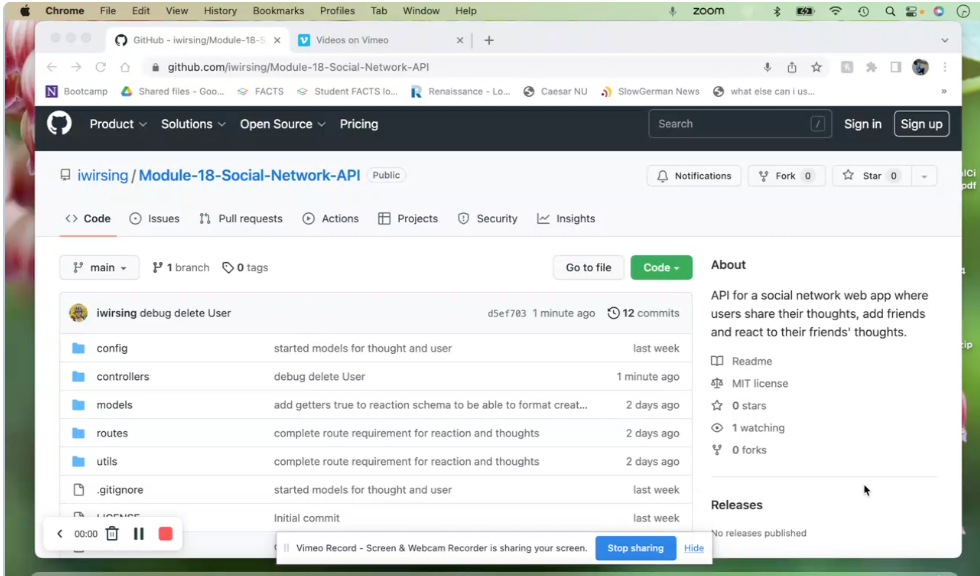

# Module 18 Challenge: Social Network API

##  Description:

This is an API for a social network web application where users can  add  or remove friends, share , edit or delete their thoughts, and react to thoughts. The technologies used are Express for routing, Mongoose to  manipulate the MongoDB database.

##  Table of Contents 
1. [Installation](#installation)
2. [Usage and Features](#usage-and-features)  
3. [Walkthrough Video and Screenshot](#walkthrough-video-and-screenshot)
4. [Contributing](#contributing) 
5. [Test](#test) 
6. [Questions](#questions)
7. [License](#license)

## Installation 

1. Download files in local folder and unzip.
2. Open folder in terminal.
3. Use `npm install` to install the modules needed for the project.

## Usage and Features

1. This app is run in the terminal using `npm run start` 
2. Perform routing test Postman or Insomnia or some other similar software.

This app uses MondoDB through Mongoose models and commands. Querying this DB displays results in formatted JSON.

On top of GET, POST, PUT and DELETE can be performed on Users and Thoughts in this social network API.

User's friends list and reactions to thoughts can be created and deleted. Also, when the User is deleted all the associated thoughts will be deleted as well through deleteMany.

## Walkthrough Video and Screenshot

Click the image below to view the video walkthrough of this app.

## Contributing 

Ask the author and use according to the MIT license.

## Test 

Test the routes by performing HTTP endpoint testing using Postman or Insomnia or any other similar application.

Here are the routes for testing:

USERS
1. Creating users: POST http://localhost:3001/api/users
2. Find all users: GET http://localhost:3001/api/users
3. Find user by ID: GET http://localhost:3001/api/users/:userID where :userID is replaced by actual ID of user.
4. Update user by ID: PUT http://localhost:3001/api/users/:userID where :userID is replaced by actual ID of user.
5. Delete user (and associated thoughts) by ID: DELETE http://localhost:3001/api/users/:userID where :userID replaced by actual ID of user.

THOUGHTS
1. Creating thought: POST http://localhost:3001/api/thoughts/:userID where :userID is replaced by actual ID of user.
2. Find all thoughts: GET http://localhost:3001/api/thoughts
3. Find thought by ID: GET http://localhost:3001/api/thoughts/:thoughtID where :thoughtID is replaced by actual ID of thought.
4. Update thought by ID: PUT http://localhost:3001/api/thoughts/:thoughtID where :thoughtID is replaced by actual ID of thought.
5. Delete thought by ID: DELETE http://localhost:3001/api/thoughts/:thoughtID where :thoughtID is replaced by actual ID of thought.

REACTIONS
1. Creating reaction: POST http://localhost:3001/api/thoughts/:thoughtID/react where :thoughtID is replaced by actual ID of thought.
2. Deleting reaction: DELETE http://localhost:3001/api/thoughts/:thoughtID/:reactID where :thoughtID is replaced by actual ID of thought and :reactID is replaced by reactionId of reaction.

FRIENDS
1. Add friends: POST http://localhost:3001/api/users/:userID/:friendID where :userID is replaced by actual ID of current user and :friendID is actual ID of another user that the current user wants to add as friend.
2. Delete friends: POST http://localhost:3001/api/users/:userID/:friendID where :userID is replaced by actual ID of current user and :friendID is actual ID of another user that the current user wants to remove as friend.
 
## Questions? 

Please contact me through any of the following:

1. My [Github](https://github.com/iwirsing).
2. Email: <a href="mailto:ivymolina@gmail.com">ivymolina@gmail.com</a>

## License
    
The project in covered under the [MIT](https://opensource.org/licenses/MIT) license

